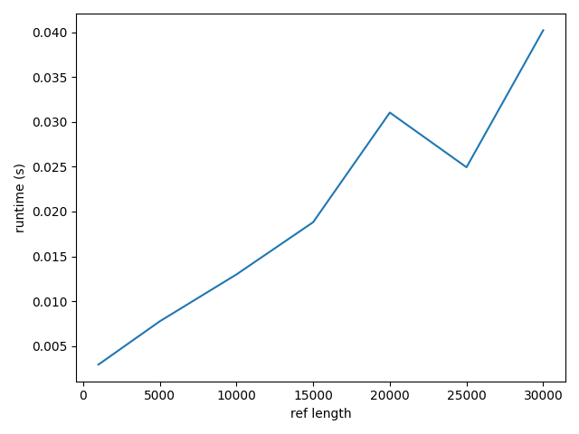
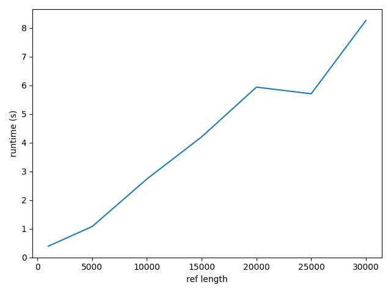
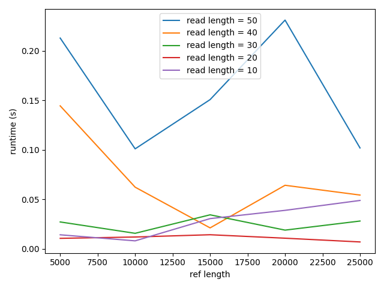
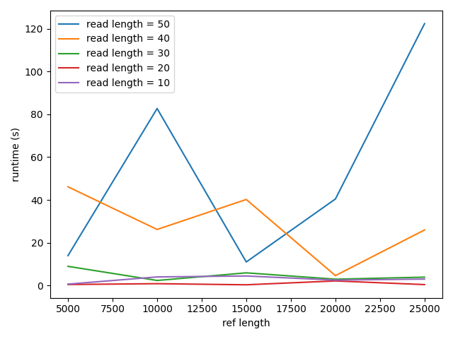

# Project 5: building your very own readmapper

# OBS!!!
# -p test is turned off because it gets rejected by the test script.
*It runs fine on my computer and i cant see what should be wrong with it. It creates a dict with each fasta-rec as key and corresponding suffix array as value, exporting it to .json in the same dir as the input data is located????????????!*

In this final project, you will write a complete read mapper.

The read mapper should be able to preprocess a reference genome. To avoid preprocessing each time you need to map reads, you should store the preprocessed data structures on disk. Reference genomes come in Simple-FASTA format, as usual, and reads in Simple-FASTQ format, and your tool must write matches to standard out in Simple-SAM.

Your program, which should be named `readmap`, and should take the following options:

* `readmap -p genome.fa` should preprocess the genome
* `readmap -d k genome.fa reads.fq` should do read-mapping for matches within an edit distance .


## Assembly required

If you have made all project and all exercises you will have most of what goes into a readmapper.

1. You implemented the file format parsers in the first week of the class, and you have been using them in the four previous projects.
2. If you map using a suffix tree, you have implemented it in project 2.
3. If you map using Li & Durbin’s algorithm you implemented most of the necessary data structures in projects 3 and 4.

## Batteries not included

You have not implemented approximative matching, so you have to implement that now.

## Testing

You can use the [gsa] Python package for generating test data and running tests. You can clone it from the GitHub repository or use:

```bash
> python3 -m pip install git+https://github.com/birc-gsa/gsa#egg=gsa
```

Amongst other things, the tool can simulate data. If you run, for example

```bash
> gsa simulate genome 23 100000 > genome.fa
```

you will simulate a genome with 23 chromosomes, each of length 100,000.

After that,

```bash
> gsa simulate reads genome.fa 2000 100
```

will simulate 2000 reads of length 100.

If you then do

```bash
> gsa search genome.fa reads.fq approx -e 1 bwt
```

to find all the hits within one edit distance of a read. If you want it faster, preprocess the genome first with

```bash
> gsa preprocess genome.fa approx-bwt
```

You should notice a speed difference; you want to achieve the same with your own preprocessing.

You can use the tool to test your read mapper as well. This requires a spec file that defines how tools should be tested. It can look like this:

```yaml
tools:
  GSA:
    preprocess: "gsa preprocess {genome} approx-bwt"
    map: "gsa search {genome} {reads} -o {outfile} approx -e {e} bwt"
  readmap:
    preprocess: "{root}/readmap -p {genome}"
    map: "{root}/readmap -d {e} {genome} {reads} > {outfile}"

reference-tool: GSA

genomes:
  length: [1000, 5000, 10000]
  chromosomes: 10

reads:
  number: 10
  length: 10
  edits: [0, 1, 2]
```

The `tools` section is a list of tools to run, each with a `preprocess` and a `map` command line. You can have as many as you like. The `reference-tool` selects which tool to consider “correct”; all other tools are compared against its results. Then `genomes` specify the genome length and number of chromosomes. Lists here will add a test for each combination. Similarly, the `reads` specify the reads, their number and length and how many edits the simulation and the readmapping will use.

The variables in `{...}` are used by `gsa` when you specify command lines. `{root}` refers to the directory where the YAML file sits, so if your tool and the YAML file are in the same directory, your tool is at `{root}/readmap`. The `{genome}` and `{reads}` tags are the input files and `{outfile}` the name of the output file. Don’t get inventive with the command line for your tool, though, I also have a test ready to run, and if you do not implement the interface specified above, the test will fail (and that will be your problem and not mine).

If you put this file in `tests.yml`, and you have the tool `readmap`, you can run the test with

```bash
> gsa -v test tests.yaml
```

The read mapper in `gsa` doesn’t output matches with leading or training deletions. We talk about why, and how you avoid it as well, in the exercises. Keep that in mind when you are developing your own tool.

## Evaluation

Once you have implemented the `readmap` program (and tested it to the best of your abilities) fill out the report below, and notify me that your pull request is ready for review.

# Report

## Algorithm

*Which algorithm did you use for read mapping?*

# Awnser:
I dont really know (i have glued some ideas that i like together). It is based on the pigenhole principle (as called by ben langemead in some youtube video, but i dont know if thats the actual name). 
So if one allow d mismatches and we devide the pattern in d+1 pieces one of them must be an exact match.
Next i generate all posible intervals of the pattern given d mismatches. Then I use a local alignment and from the corresponding matrix i select the smallest value (2 * d entries away from last entry; last row and col). 2 * d because one goes to actual edits + one d since i need to generate a flexible interval to find all possible matches within d edits (since the start position is with respect to the pattern and not the reference string). Hereafter i scan the matrix starting from top left to find all combinations within d edits.

## Insights you may have had while implementing the algorithm

# Awnser:
I should have used FM index. This was really hard for me to actuall make work. The idea is simple but a lot of lose ends to tie together before it actually worked. It is also pretty slow and i wanted to compete because i think my suffix-array construction function is actually pretty fast. I have learned a lot though and it has been nearly (but really only nearly) as much fun as it has been frustrating.

## Problems encountered if any
Everything. I did everything five times different ways. 

## Validation

*How did you validate that the algorithm works?*

# Awnser:
Compared it against the GSA tool provided. 

## Running time

*List experiments and results that illustrates the running time. Add figures by embedding them here, as you learned how to do in project 1.*


Different ref/string lengths:
(read length = 10; d = 1)
 



Different ref/string lengths:
(read length = 10; d = 2)




Different pattern lengths (d=1):




Different pattern lengths (d=2):




